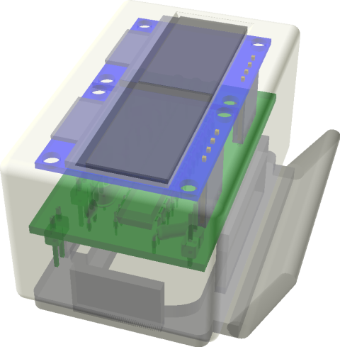
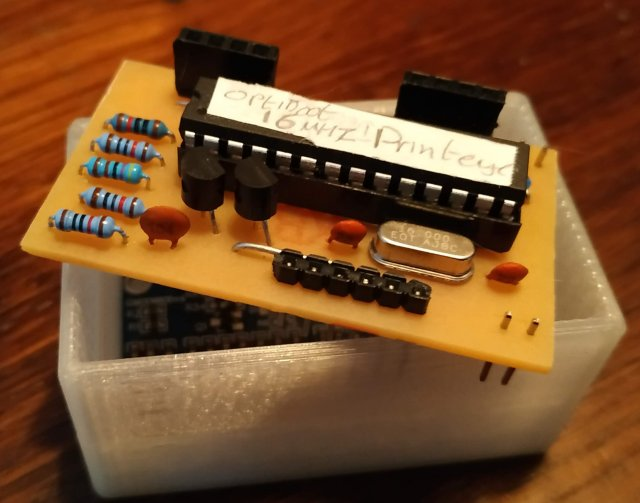

# Duet 'PrintEye' temperature display hardware
## This repository is dedicated to the Hardware used in the printEye; For the full firmware and project description please go to:
## https://github.com/easytarget/PrintEye

This is a low cost and lightweight temperature and status monitor for 3d Printers using Duet (or other repRap Firmware) controllers.

* Atmega328P based
* 2 x 0.96' OLED displays on individual I2C busses
* Level Shifter for Serial connections (duet is 3.2v, 328p is 5v)
* A button
* A LED
* A case
* I include the full KiCad project, exported Gerber Files and more.

PCB Notes:
* The layout is single sided (despite the render above).
 * There are three bridges that need to be placed as well as the components on the top side.
* Track and pad size+spacing in the PCB layout is pretty generous, but this is a smallish board so some care is needed ;-)
* The FTDI connector needs to be placed on the reverse (copper) side of the PCB.

The included case is designed to have the OLED panels glued in place. The PCB then mounts onto their connectors.
* Glue it lightly! I used generic contact adhesive; this is strong enough but will allow the displays to be gently levered out if needed in the future.
* The case back is a press fit, the plug slot in the back is sized for a dupont connector.
* Fitting and mounting the LED and button I leave up to you.
 * I used thin insulated solid core wires to hold the LED positioned between the two OLED connectors, with a translucent case this is very effective.
 * The button recess is sized for a 12mm push button; glue it in place and then run wires to the PCB. I used a dupont connector here too.

####[Full Schematic](./docs/PrintEye-Schematic.pdf)

####Parts List:
|Ref|Qnty|Value|KiCad Part|Description|
|---|----|-----|----|-----------|
|C1,C2|2|22pF|Device:C|Unpolarized capacitor|
|C5|1|100nF|Device:C|Unpolarized capacitor|
|OLED1,OLED2|2|SSD1315_I2C_OLED|OLED|0.96' OLED I2C display|
|Q1,Q2|2|2N7000|Transistor_FET:2N7000|N-Channel MOSFET, 2.6V Logic Level, TO-92|
|R1,R3,R4,R5|4|10K|Device:R|Resistor|
|R2|1|4K7|Device:R|Resistor|
|R6|1|120R|Device:R|Resistor|
|U1|1|ATmega328-PU|MCU_Microchip_ATmega:ATmega328-PU|20MHz, 32kB Flash, 2kB SRAM, 1kB EEPROM, DIP-28|
|Y1|1|16MHz|Device:Crystal|HC49-4H_Vertical	Two pin crystal|

