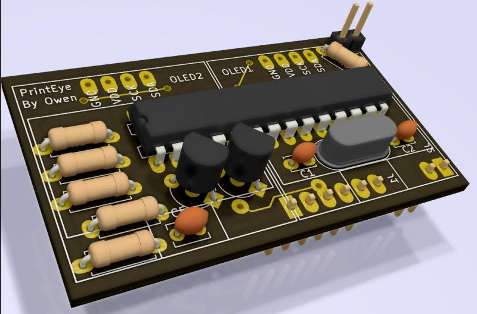
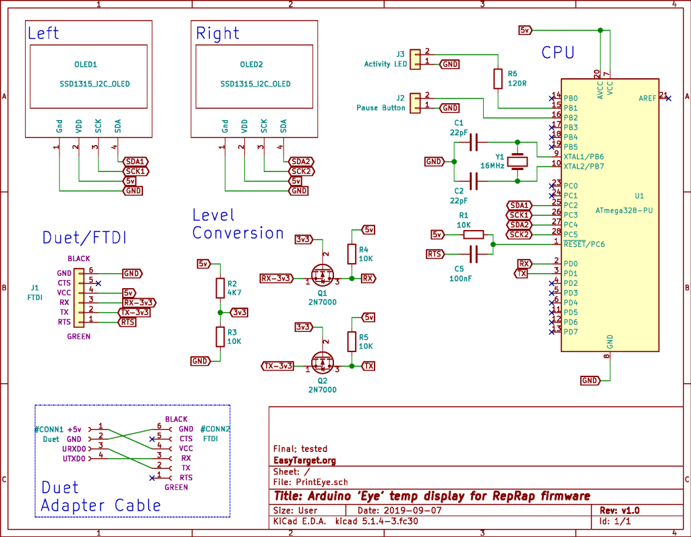

# Duet 'PrintEye' temperature display hardware
* Firmware @ https://easytarget.org/ogit/ard/PrintEye
* Atmega328P based
* 2xOLED displays
* Level Shifter for Serial (duet is 3.2v, 328p is 5v)
* A button
* A LED

i
[Full Schematic](./docs/PrintEye-Schematic.pdf)
